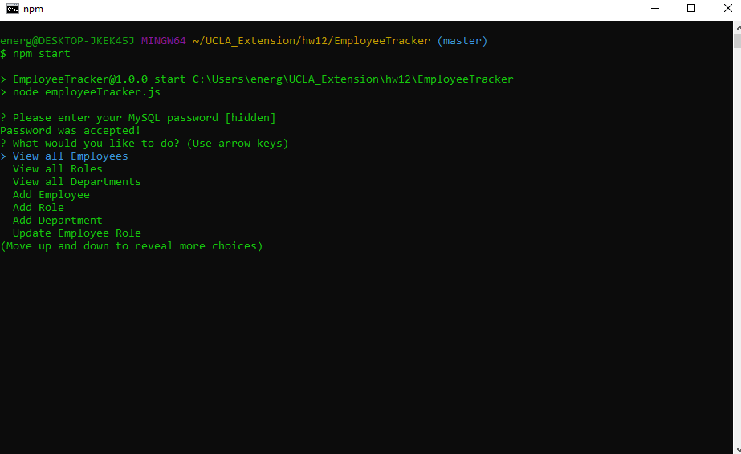
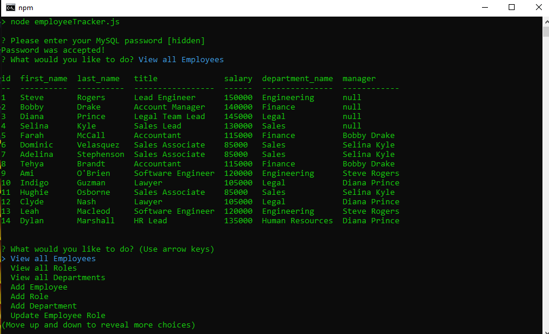

# EmployeeTracker
  
  ## Table of Contents
  [Description](#description)

  [Installation](#installation)

  [Usage](#usage)

  [Video](#video)

  [License](#license)

  [Notes](#notes)

  [Questions](#questions)
  ## Description
  This program will help manage a company's departments, roles, and employees.<br>
  ## Installation
  In your terminal:
  ```bash
  npm install
  npm install mysql
  npm install inquirer
  npm install console.table
  ```
  ## Usage
  The user may use the employee_tracker.sql schema to create the database and the included sql seeds to populate them with information. A file called shortcut-seed.sql has also been included to create or reset the database with fully populated information as well.

  The user can then use the following command to begin the program:
  ```bash
  npm start
  ```
  The user will enter their MySQL password as the first prompt of the terminal which (if accepted) will reveal the main menu.
  
  The user can navigate the menus and answer the prompts as needed.<br>
  "View" menu options will produce a table that will continue to update as the database gets edited.
  
  If the user wishes to add or update information regarding any of the tables, they will be asked to fill certain information:<br>
  Employees will require a full name, role, and manager.<br>
  Roles will require a title, salary, and department that has already been created.<br>
  Departments will only require the name of the department.<br>
  The user can choose the "End Program" menu item to end the program and close the MySQL connection.
  ## Video
  An example of the full workflow is shown in the video link below:<br><br>
  [Workflow Video](https://drive.google.com/file/d/1DpeLfviiWNYmrORduZR0Yxos0hFSrqpF/view)
  ## License
  MIT
  ## Notes
  If the user prefers to hardcode their password into the database, they may replace or remove the result.pass variable at the top of the employeeTracker page where the connection and database information is established. To then run the program, just press enter when asked for your password. 
  ## Questions
  For any further questions, you may contact me at:
  github: http://github.com/mgmoreno22